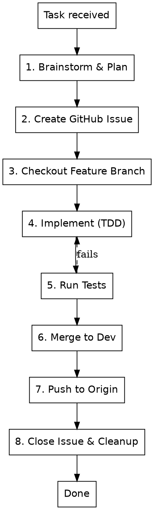

# Fix Issue Workflow

## Overview

Complete development workflow for SipSignal: from analysis through implementation to merge.

## When to Use

- Implementing new features
- Fixing bugs
- Refactoring code
- Any code change requiring a GitHub issue

## Workflow



## Steps

### 1. Brainstorm & Plan
**REQUIRED:** Use `superpowers:brainstorming` before any code changes.

```
superpowers:brainstorming "[task description]"
```

### 2. Create GitHub Issue
```bash
gh issue create \
  --title "[type]: [description]" \
  --body "## Description\n\n[details]\n\n## Acceptance Criteria\n\n- [ ] criterion 1" \
  --label "enhancement|bug" \
  --milestone "[current milestone]"
```

Capture the issue number: `#NNN`

### 3. Checkout Feature Branch
```bash
git checkout -b feature/NNN-short-name dev
```

### 4. Implement with TDD
**REQUIRED:** Use `superpowers:test-driven-development`

- Write tests first
- Watch them fail (RED)
- Write minimal code (GREEN)
- Refactor

### 5. Run Tests
```bash
python -m pytest tests/ -v
```

All tests must pass. Fix failures before proceeding.

### 6. Merge to Dev
```bash
git checkout dev
git merge --no-ff feature/NNN-short-name
```

### 7. Push to Origin
```bash
git commit -m "[type]: [description] (#NNN)"
git push origin dev
```

### 8. Close Issue & Cleanup
```bash
gh issue close NNN
git branch -d feature/NNN-short-name
```

## Commit Types

| Type | Use for |
|------|---------|
| feat | New feature |
| fix | Bug fix |
| refactor | Code restructuring |
| test | Adding tests |
| docs | Documentation |
| chore | Maintenance |

## Red Flags

- **No brainstorming first** → STOP. Use superpowers:brainstorming.
- **No GitHub issue** → STOP. Create issue before branch.
- **Tests failing** → STOP. Fix before merge.
- **Committing to dev directly** → STOP. Use feature branch.
